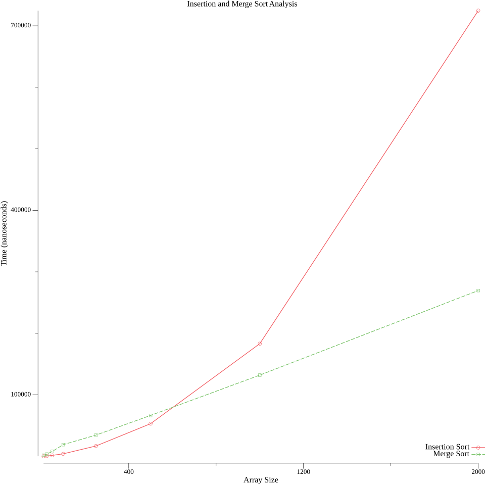

# Computational Complexity using Experimental Mathematics

## Observations



Insertion sort performed better for array sizes less than or equal to 500. 

We increased the array size to 1000 and 2000 to get more results as we didn’t see merge sort performing better than insertion sort.

Merge sort performed better for array sizes greater than 500 at 1000 and 2000 as shown in the above graph.

---

## Detailed Analysis of Quicksort Algorithm with Experimental Mathematics

**INTRODUCTION**: Sorting algorithms reorder the list of elements numerically or lexicographically. Efficient sorting improves the performance of other algorithms which rely on sorted input data. This paper focuses on quick sort algorithm analysis.

**RELATED WORK**: Quicksort's performance depends on swaps and comparisons. Studying swaps is challenging because it depends on the specific implementation. Quicksort mode in [EZ1] is that picks the pivot randomly compares it with the remaining elements and divides the smaller and larger elements into two new lists l1 and l2. No swap is required but lots of memory is wasted. Let us call this variant a Variant Nulla.

**VARIANT - 1**: We choose the first or last element as the pivot and then we compare other non-pivot elements with the pivot. If a non pivot element is small then we place it before the pivot, shifting every element one index to the right. This process involves comparisons and swaps. After n-1 comparisons and some swaps, we achieve that the elements left to the pivot are smaller than the pivot and right to the pivot are greater than the pivot. The difference between this Variant and Variant Nulla is it saves memory.

**VARIANT - 2**: Pivot is chosen at random. a[i] < pivot stays there, Otherwise moved to the end of the list. At the same time, moving all the elements to the left side. For the right side If a[i] > pivot, no change Else, the element will be moved to the pivot’s place, and all elements from the index of the pivot should move to the right side. For calculating the number of swaps, count the  number of elements which are before K and greater than K (or) after K and smaller than K. Therefore, the number of swaps = i+K-2-2j

**VARIANT - 3**: It is called the Lomuto partition scheme. Two indexes ‘i’ - insertion index, ‘j’ - search index. 

```bash
PseudoCode: algorithm quicksort(A, s, t) is 
	if s < t then 
		p := partition(A, s, t)
    		quicksort(A, s, p - 1)
    		quicksort(A, p + 1, t)				
	algorithm partition(A, s, t) is 
pivot := A[t]
 	i := sThe code
 	for j := s to t - 1 do 
	if A[j] < pivot then 
		swap A[i] with A[j] 
		i := i + 1 
	swap A[i] with A[t]
Totally there are K swaps in the algorithm ‘Partition’.
```

**VARIANT - 4**: In variant 3 the swapping of elements occurs even if in the case of i = j which is a waste of time. Whereas, in variant 4 the elements will not be swapped in case of i = j. It’s better than the previous variant adding the lines to validate the insertion and search indexes is totally worth it.

**VARIANT - 5**: The idea of using the middle element as a pivot might increase the algorithm's performance, making it perform better in the average scenario. But it might not be practical. Here we are choosing the first or last element as a pivot which is closer to the middle element. If both are at the same distance, then it is your choice. The only difference with variant 4 is the probability of K which is not 1/n for each K €[n] and more

**MULTIPLE PIVOT QUICKSORT**: This uses multiple pivot elements for sorting. While standard quicksort uses a single pivot. Multiple pivot explores the idea of using K pivots. when k>1 and it introduces added complexity to the sorting process. In multiple pivot Quicksort, K pivot elements are chosen, and they are treated as pivots and are sorted. The remaining elements are divided into one of the k+1 sub-lists. Multi-pivot Quicksort is more complicated because it involves determining how to sort the K pivots, and how to allocate non-pivot elements to the appropriate sub-list. 

**DUAL PIVOT QUICKSORT**: The first variant is dual pivot Quicksort which is the simplest form of multi pivot Quicksort. Two points p1 and p2 randomly selected these pivots are sorted such that p1<p2. The non-pivot elements are divided into their sub-lists L1: elements smaller than p1, L2: elements between p1 and p2, L3: elements greater than p3. One comparison to sort two pivots (i < j) and 2n-i-3 comparisons to distribute non-pivot elements into sublists. 

**THREE-PIVOT QUICKSORT**: In Three-pivot Quicksort, we need to define - How to sort the pivots, How to partition the list into sublists and How to sort a list or sublist containing less than 3 pivots. 1-pivot Quicksort is used for sorting the pivots and sorting a list having less than 3 pivots. Binary search is used to partition the list into sublists. Referring to expressions we can know that 3-pivot Quicksort has better performance than dual-pivot. Coming to average performance for n>3, 3-pivot Quicksort performs better than 1-pivot and 2-pivot. When comparing the probability generating function for the number of comparisons, it is not as efficient as the ordinary 1-pivot Quicksort. The number of swaps depends upon the specific implementation.

**K-PIVOT QUICKSORT**: As discussed in 3-pivot, we must consider 3 steps. According to the probability generating function, it is not efficient when k is large and binary search complexity also becomes challenging. We found that for large datasets more pivots are required and fewer comparisons. But if K is near to n, excess pivots can cause inefficiency.

**LIMITING DISTRIBUTION**: This paper aims to compare the efficiency and explore better algorithms using explicit expressions for Quick Sort moments. It needs additional moments for larger datasets and their approximation.

**FUTURE WORK**: Continuous advancements are possible in Quick Sort research. The best approach may vary based on number range and pivot ranking. Navi's approach tells us two cases for the currently to-be-sorted list. The Sub list containing elements less than ‘K’ uses 1-pivot otherwise we can still use K-pivots.
